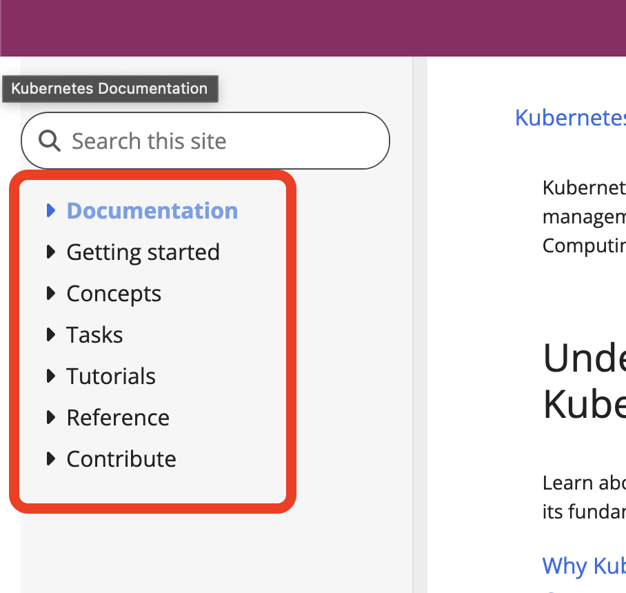

# Kubernetes PDF Documentation

This repository contains all the [Kubernetes documentation](https://kubernetes.io/docs/home/) in PDF format used in NotebookLM.

## How the files are structured?
PDF files can be found under PDFs directory. Each PDF is a section in the site.

* Documentation (ignored)
* Getting started - Setup.pdf
* Concepts - Concepts.pdf
* Tasks - Tasks.pdf
* Tutorials - Tutorials.pdf
* Reference - Reference.pdf
* Contribute - Contrubute.pdf



## Dependencies
* docker (could be Docker UI)
* requests-html
* lxml_html_clean

# How to run the code
1. Clone the repository.
2. Run Docker UI
3. Install dependencies
```shell
pip install requests-html
pip install lxml_html_clean
```
4. Run `kubernetes-doc.py`
```shell
python kubernetes-doc.py
```

# References:

This project is an updated version of [Kubernetes PDF Documentation](https://github.com/dohsimpson/kubernetes-doc-pdf)
